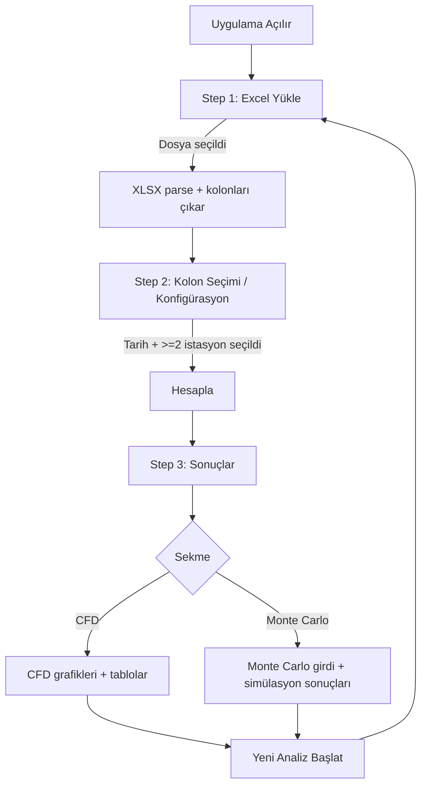
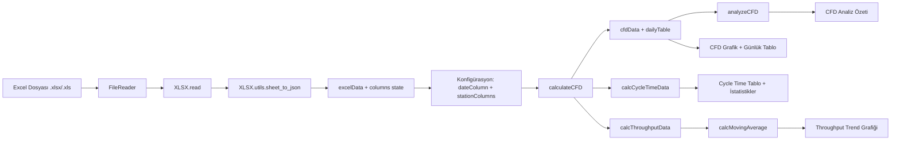
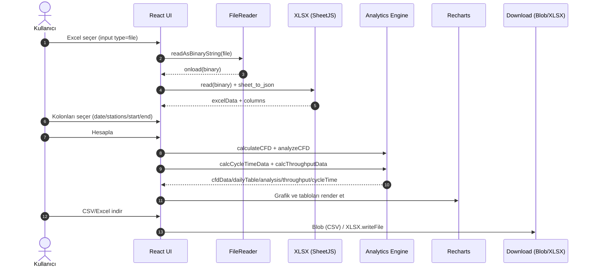
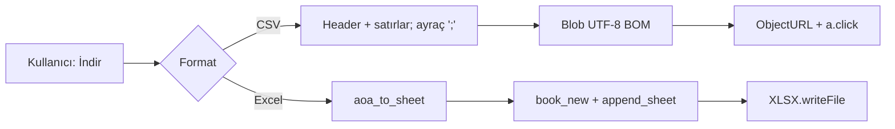

# Kanban Analytics Suite - Proje Dokümantasyonu

## 1. Projenin Genel Tanımı ve Amacı
**Kanban Analytics Suite**, Kanban metodolojisi ile çalışan yazılım geliştirme ve proje yönetimi ekipleri için tasarlanmış, web tabanlı bir veri analitiği ve görselleştirme aracıdır. 

Bu projenin temel amacı, ekiplerin tarihsel verilerini (Excel formatında) kullanarak süreç performanslarını ölçmelerini, darboğazları tespit etmelerini ve **Monte Carlo Simülasyonu** gibi ileri düzey istatistiksel yöntemlerle geleceğe yönelik gerçekçi tahminler (forecasting) yapmalarını sağlamaktır. Uygulama, verileri tamamen tarayıcı üzerinde işleyerek (client-side), herhangi bir sunucuya veri göndermeden güvenli ve hızlı bir analiz imkanı sunar.

## 2. Proje Kapsamı ve Hedefleri
### Kapsam
Proje, kullanıcıların ham iş takip verilerini (Jira, Azure DevOps veya manuel Excel tabloları) anlamlı grafiklere ve metriklerine dönüştüren tek sayfalık bir uygulamayı (SPA) kapsar. 
*   **Giriş:** .xlsx veya .xls formatındaki Excel dosyaları.
*   **İşlem:** Veri temizleme, kolon eşleştirme, metrik hesaplama (Cycle Time, Throughput, WIP).
*   **Çıktı:** Etkileşimli grafikler (CFD, Throughput, Histogram), istatistiksel özetler ve indirilebilir raporlar.

### Hedefler
*   **Süreç Görünürlüğü:** İş akışındaki birikmeleri ve darboğazları görünür kılmak.
*   **Veriye Dayalı Karar:** Tahminleri hislere değil, tarihsel veriye (Throughput) dayandırmak.
*   **Kullanım Kolaylığı:** Karmaşık kurulumlar gerektirmeden, sadece bir Excel dosyası ile saniyeler içinde analiz yapabilmek.
*   **Eğitici İçgörü:** CFD analizi ile otomatik uyarılar (örn: "Artan WIP Trendi") üreterek kullanıcıyı yönlendirmek.

## 3. Kullanılan Teknolojiler ve Altyapı Detayları
Proje, modern frontend teknolojileri kullanılarak geliştirilmiştir:

*   **Core Framework:** React 19
*   **Build Tool:** Vite (Hızlı geliştirme ve optimize edilmiş build için)
*   **Programlama Dili:** JavaScript (ES6+) / JSX
*   **Stil Şablonu:** Tailwind CSS v4 (Utility-first CSS framework)
*   **Veri İşleme:** 
    *   `xlsx` (SheetJS): Excel dosyalarını tarayıcıda okumak ve parse etmek için.
*   **Görselleştirme:** 
    *   `recharts`: React tabanlı, responsive grafik kütüphanesi (Area, Bar, Line, Composed Charts).
    *   `lucide-react`: Modern ve hafif ikon seti.
*   **Dağıtım (Deployment):** Statik web sitesi olarak herhangi bir CDN (Vercel, Netlify, GitHub Pages) üzerinde çalışabilir.

## 4. Proje Mimarisi ve Bileşen Diyagramları
Proje, "Monolithic Component" yapısına yakın, ancak mantıksal olarak ayrılmış bir mimariye sahiptir. Ana mantık `KanbanAnalyticsSuite.jsx` dosyasında toplanmıştır.

### Mimari Akış
1.  **Veri Katmanı:** Kullanıcı Excel dosyasını yükler -> `FileReader` ve `XLSX` kütüphanesi veriyi JSON formatına çevirir.
2.  **Konfigürasyon Katmanı:** Kullanıcı UI üzerinden kolon eşleştirmelerini (Tarih, İstasyonlar, Start/End) yapar.
3.  **Hesaplama Motoru (Engine):** 
    *   `calculateCFD`: Günlük kümülatif akışı hesaplar.
    *   `calcCycleTimeData`: Her işin başlangıç ve bitiş sürelerini hesaplar.
    *   `runMonteCarloSimulation`: 10.000 iterasyon ile olasılıksal tahminleme yapar.
4.  **Sunum Katmanı (View):** Hesaplanan veriler `recharts` bileşenlerine ve özet tablolara aktarılır.

### Dosya Yapısı
```
src/
├── KanbanAnalyticsSuite.jsx  # Ana Uygulama Mantığı ve UI
├── App.jsx                   # Root Component
├── main.jsx                  # Entry Point
└── index.css                 # Tailwind importları
```

## 5. Temel İşlevsellikler ve Özellikler
### A. Veri Yükleme ve Yapılandırma
*   Sürükle-bırak Excel yükleme.
*   Dinamik kolon tespiti ve eşleştirme.
*   İstasyon (kolon) sırasını sürükleyerek veya butonlarla düzenleme.

### B. Cumulative Flow Diagram (CFD)
*   Zaman içindeki iş dağılımını (To Do, In Progress, Done) gösteren alan grafiği.
*   **Otomatik Analiz:** Darboğazlar, WIP artışları ve yüksek dalgalanmalar için akıllı uyarı sistemi.
*   Zoom/Tam Ekran modu.

### C. Cycle Time Analizi
*   Her bir işin (PBI) ne kadar sürede tamamlandığının hesaplanması.
*   Min, Max, Ortalama, Medyan ve %85 (Percentile) istatistikleri.
*   Verilerin CSV olarak dışa aktarımı.

### D. Throughput Trendi
*   Aylık tamamlanan iş sayısı.
*   Hareketli Ortalama (Moving Average - 2, 3, 4, 6 aylık) çizgisi ile trend takibi.

### E. Monte Carlo Simülasyonu
*   **"Ne Kadar İş?" (How Many):** Belirli bir tarihe kadar kaç işin biteceğini tahminler.
*   **"Ne Zaman Biter?" (When):** Belirli sayıdaki işin ne zaman biteceğini tahminler.
*   Tarihsel günlük throughput verisinden rastgele örnekleme (Bootstrap yöntemi) ile 10.000 simülasyon koşar.
*   %50, %85, %90 güven aralıkları ile sonuç üretir.

### F. Raporlama ve Dışa Aktarım
*   Grafiklerin SVG ve PNG olarak indirilmesi.
*   İşlenmiş verilerin (CFD tablosu, Cycle Time listesi) CSV ve Excel formatında indirilmesi.

## 6. Kullanıcı Senaryoları ve Akış Diyagramları
### Genel Kullanıcı Akışı (Uygulama Adımları)


### Senaryo 1: Sağlık Kontrolü (Health Check)
1.  **Kullanıcı:** Proje yöneticisi, takımın son 3 aydaki performansını merak eder.
2.  **Aksiyon:** Excel dosyasını yükler. Tarih kolonunu ve "Analiz", "Geliştirme", "Test", "Canlı" kolonlarını seçer.
3.  **Sonuç:** CFD grafiği çizilir. Sistem, "Test" aşamasında bir darboğaz olduğunu (artan dikey genişlik) ve WIP'in (Work In Progress) son ayda %20 arttığını "Analiz Özeti" kutusunda uyarı olarak gösterir.

### Senaryo 2: Teslimat Tahmini (Forecasting)
1.  **Kullanıcı:** Product Owner, "Backlog'daki 50 iş ne zaman biter?" sorusuna cevap arar.
2.  **Aksiyon:** "Monte Carlo" sekmesine geçer. Simülasyon tipini "Ne Zaman Biter?" seçer. Hedef PBI sayısını 50 girer.
3.  **Sonuç:** Simülasyon çalışır. Sistem: "50 işin bitmesi için %85 olasılıkla 42 gün gereklidir (Tahmini Tarih: 15 Mart)" sonucunu histogram grafiği ile gösterir.

### Veri İşleme Akışı (Excel → Analitik Sonuçlar)


## 7. Veritabanı Şeması
Bu proje **serverless** ve **database-less** bir mimariye sahiptir. Tüm veriler kullanıcının yüklediği Excel dosyasından anlık olarak okunur ve React state'inde (RAM) tutulur. Sayfa yenilendiğinde veriler sıfırlanır. Kalıcı bir veritabanı şeması yoktur.

## 8. API Spesifikasyonları
Proje herhangi bir dış API kullanmaz ve dışarıya API sunmaz. Tüm işlemler istemci tarafında (Client-Side) gerçekleşir.

## 9. Kurulum ve Dağıtım Talimatları
### Gereksinimler
*   Node.js (v18 veya üzeri)
*   npm veya pnpm

### Kurulum Adımları
1.  Projeyi klonlayın:
    ```bash
    git clone https://github.com/sadikalgul/kanban-suite.git
    cd kanban-suite
    ```
2.  Bağımlılıkları yükleyin:
    ```bash
    npm install
    ```
3.  Geliştirme sunucusunu başlatın:
    ```bash
    npm run dev
    ```
    Uygulama `http://localhost:5173` adresinde çalışacaktır.

### Canlıya Alma (Build & Deploy)
Uygulamayı statik dosyalara derlemek için:
```bash
npm run build
```
Oluşan `dist` klasörü herhangi bir statik hosting servisine (Netlify, Vercel, Apache/Nginx server) yüklenebilir.

## 10. Test Stratejisi ve Metodolojisi
Mevcut durumda proje manuel testlere dayanmaktadır, ancak önerilen test stratejisi şöyledir:

*   **Unit Testler:** Özellikle `runMonteCarloSimulation` ve `analyzeCFD` gibi matematiksel yoğunluklu fonksiyonlar için Jest/Vitest kullanılmalıdır. (Girdi: Throughput array -> Çıktı: p85 değeri doğruluğu).
*   **Entegrasyon Testleri:** Excel dosya okuma ve parse etme mantığının doğrulanması.
*   **E2E Testleri:** Cypress veya Playwright ile dosya yükleme, konfigürasyon seçimi ve grafiğin ekrana gelme akışının test edilmesi.

## 11. Proje Sürüm Geçmişi
*   **v1.0.0 (Mevcut):**
    *   Temel Excel yükleme ve parsing.
    *   Dinamik CFD oluşturma.
    *   Cycle Time ve Throughput hesaplamaları.
    *   Monte Carlo Simülasyonu (How Many / When).
    *   Görsel ve Veri dışa aktarım (Export) özellikleri.

## 12. Teknik Mimari Dokümanı (Detaylı)
Bu bölüm, uygulamanın çalıştırma zamanı bileşenlerini, veri akışını, hesaplama motorunu ve dağıtım/topoloji detaylarını daha teknik seviyede anlatır.

### 12.1 Sistem Bağlamı
Uygulama “tamamen istemci tarafında” (browser) çalışan bir **SPA**’dır. Excel verisi tarayıcıda okunur, işlenir, görselleştirilir ve dışa aktarılır. Sunucu tarafında API, veritabanı veya kalıcı depolama yoktur.

### 12.2 Çalışma Zamanı (Runtime) Mimarisi
**Runtime topolojisi**:
*   Kullanıcı tarayıcısı (React + Recharts + XLSX)
*   Statik içerik barındırma (CDN/Hosting: Vercel/Netlify vb.)

**Yüksek seviyeli akış**:
1.  Kullanıcı Excel dosyasını seçer.
2.  Tarayıcı `FileReader` ile dosyayı okur.
3.  `xlsx` (SheetJS) ilk sayfayı JSON’a çevirir.
4.  Uygulama kolonları çıkarır ve kullanıcıdan eşleştirme/konfigürasyon ister.
5.  CFD/Cycle Time/Throughput/Monte Carlo hesapları tarayıcıda yapılır.
6.  Sonuçlar grafik ve tablolar olarak çizilir; CSV/Excel olarak indirilebilir.



### 12.2.1 Monte Carlo Simülasyonu Akışı
```mermaid
flowchart TD
  A[Monte Carlo Sekmesi] --> B{cycleTimeEnd seçili mi?}
  B -->|Hayır| C[Uyarı: End İstasyonu Seçilmedi]
  B -->|Evet| D[useMemo: Günlük throughput üret]
  D --> E{Simülasyon Tipi}
  E -->|howMany| F[Hedef gün sayısı (start/end)]
  E -->|when| G[Hedef iş sayısı (targetPBI)]
  F --> H[runMonteCarloSimulation 10.000 iterasyon]
  G --> H
  H --> I[p50/p85/p90 + histogram]
  I --> J[Sonuçları render et]
```

### 12.2.2 Export (CSV/Excel) Akışı


### 12.3 Build, Tooling ve Paket Yapısı
**Build aracı**: Vite  
**Giriş noktası**: `index.html` → `/src/main.jsx`  
**Kök bileşen**: `/src/main.jsx` → `/src/App.jsx` → `/src/KanbanAnalyticsSuite.jsx`

**Paketler**:
*   `react`, `react-dom`: UI katmanı
*   `@vitejs/plugin-react`: Vite React desteği (HMR, JSX)
*   `tailwindcss` v4 + `@tailwindcss/postcss`, `autoprefixer`: stil altyapısı
*   `xlsx`: Excel okuma ve yazma
*   `recharts`: grafikler (Area/Bar/Line/Composed)
*   `lucide-react`: ikonlar

### 12.4 Kaynak Kodu Organizasyonu
Uygulama mantığı ve UI büyük ölçüde tek dosyada toplanmıştır:
*   `src/KanbanAnalyticsSuite.jsx`: veri işleme + hesaplamalar + ekranlar (Step 1/2/3) + modallar
*   `src/App.jsx`: root wrapper
*   `src/main.jsx`: entrypoint
*   `src/index.css`: Tailwind import

Not: Repoda ayrıca kökte `kanban-analytics-suite.jsx` bulunur; ancak uygulama giriş noktası `src/` altındaki bileşenleri kullandığı için bu dosya runtime’da zorunlu değildir (muhtemelen kopya/legacy).

### 12.5 UI Bileşen Modeli ve Navigasyon
Uygulama 3 adımlı bir akışla ilerler:
*   **Step 1**: Dosya yükleme (Excel)
*   **Step 2**: Kolon seçimi ve opsiyonel ayarlar
*   **Step 3**: Sonuçlar (CFD sekmesi + Monte Carlo sekmesi)

Uygulama route bazlı navigasyon kullanmaz; adımlar `step` state’i ile kontrol edilir.

### 12.6 Durum Yönetimi (State) Stratejisi
Durum yönetimi tamamen React hook’ları ile yapılır:
*   `useState`: step, excelData, columns, config, cfdData, dailyTable, cycleTimeData, throughputData, movingAvgPeriod, fullscreen flag’leri, analysis, simulation state’leri
*   `useMemo`: Monte Carlo için günlük throughput türetimi (veri aralığına göre)
*   `useCallback`: simülasyonu çalıştıran handler
*   `useRef`: grafik alanı referansları (fullscreen/normal)

Konfigürasyon modeli (özet):
*   `dateColumn`: CFD tarih baz kolonu
*   `stationColumns`: akış istasyon kolonları (sıralı)
*   `pbiIdColumn`, `pbiNameColumn`: Cycle Time listesinde kimlik ve isim
*   `cycleTimeStart`, `cycleTimeEnd`: Cycle Time hesapları için start/end istasyonları

### 12.7 Veri Modeli ve Dönüşümler
**Girdi veri modeli**: `xlsx` ile elde edilen “satır listesi”:
*   `excelData: Array<Record<string, string>>`
*   Tarih hücreleri bazen `Date`, bazen string olabilir; bu nedenle parse edilerek normalize edilir.

**Tarih normalizasyonu**:
*   `parseDate(value)`: farklı formatları (ISO, `dd.mm.yyyy`, `yyyy-mm-dd` vb.) desteklemeye çalışır.

### 12.8 Hesaplama Motoru (Analytics Engine)
Hesaplama mantığı temel olarak tek bileşen içinde yer alır. Kritik fonksiyonlar:

#### 12.8.1 CFD (Cumulative Flow) Hesabı
*   `calculateCFD()`: Tarih aralığını min/max tarihten gün gün üretir.
*   Her hedef gün için, her satırda istasyon kolonlarının en güncel (o güne kadar) tarihini bularak “o gün iş hangi istasyonda” sayımı yapar.
*   Çıktı: `dailyTable` ve `cfdData` (tarih + istasyon sayıları + toplam).

Yaklaşık zaman karmaşıklığı (kaba): `O(G * R * S)`  
*G: gün sayısı, R: satır sayısı, S: istasyon kolon sayısı.*

#### 12.8.2 CFD Analiz Özeti
*   `analyzeCFD(data, stations)`: istasyon bazlı ortalama, trend, volatilite, bottleneck tespiti yapar.
*   Kurallara dayalı “actions” listesi üretir (warning/alert/success/info).

#### 12.8.3 Cycle Time
*   `calcCycleTimeData()`: her satır için `cycleTimeStart` ve `cycleTimeEnd` tarihlerini parse edip gün cinsinden fark alır.
*   Negatif/eksik tarihleri erken döndürerek filtreler.
*   Çıktı: `[{ pbiId, pbiName, cycleTime, startDate, endDate }]`

#### 12.8.4 Throughput (Aylık)
*   `calcThroughputData()`: `cycleTimeEnd` tarihine göre ay bazında tamamlama sayısı çıkarır.
*   Çıktı: `{ key, label, count, year, month }[]` (yıl/ay sıralı)
*   `calcMovingAverage(data, period)`: `count` üzerinden hareketli ortalama üretir.

#### 12.8.5 Monte Carlo Simülasyonu
*   Günlük throughput, `useMemo` ile son N ay (mcDataRange) aralığında hesaplanır.
*   `runMonteCarloSimulation(throughputData, targetValue, simulationType, iterations=10000)`:
    *   `howMany`: hedef gün sayısı kadar rastgele günlük throughput çekip toplar.
    *   `when`: hedef iş sayısına ulaşana kadar gün gün rastgele throughput çekerek gün sayısı üretir (365 gün guard’ı).
*   Sonuç: p50/p85/p90, min/max ve histogram.

### 12.9 Dışa Aktarım (Export) ve Dosya Çıktıları
*   `downloadTableAsCSV()`: CFD tablosunu `;` ayracı ile CSV olarak indirir (BOM ile UTF-8).
*   `downloadTableAsExcel()`: CFD tablosunu `xlsx` ile workbook olarak indirir.

### 12.10 Hata Yönetimi ve Doğrulamalar
Uygulama, kritik adımlarda guard/erken dönüşler kullanır:
*   Dosya yoksa yükleme işlemini başlatmaz.
*   Tarih kolonu veya istasyon kolonları eksikse CFD hesaplamasını engeller ve kullanıcıyı uyarır.
*   Cycle Time hesapları, start/end seçilmeden boş liste döndürür.
*   Monte Carlo, throughput verisi yoksa çalıştırılmaz.

### 12.11 Güvenlik ve Gizlilik
*   Veri tarayıcıda işlenir; uygulama ağ üzerinden veri göndermez.
*   İndirilen CSV/Excel çıktıları tamamen istemci tarafında üretilir.
*   Kullanıcının yüklediği dosya, state içinde RAM’de tutulur ve sayfa yenilenince kaybolur.

### 12.12 Dağıtım ve Hosting
Uygulama statik build üretir (`dist/`) ve SPA fallback gerektirir:
*   Netlify: `netlify.toml` ile `/* → /index.html` redirect.
*   Vercel: `vercel.json` ile rewrite `/(.*) → /index.html`.

### 12.13 Teknik Borç ve İyileştirme Alanları
*   **Tek bileşende yoğunlaşma**: `KanbanAnalyticsSuite.jsx` hem engine hem UI içerir; ileride “engine” fonksiyonlarının ayrı modüle taşınması test edilebilirliği artırır.
*   **Kopya dosya**: kökte `kanban-analytics-suite.jsx` ile `src/KanbanAnalyticsSuite.jsx` içeriği paralel ilerliyor; tek kaynağa indirilmesi bakım maliyetini düşürür.
*   **Test eksikliği**: matematiksel fonksiyonlar (özellikle Monte Carlo ve CFD analizi) için birim test eklemek regresyon riskini azaltır.
